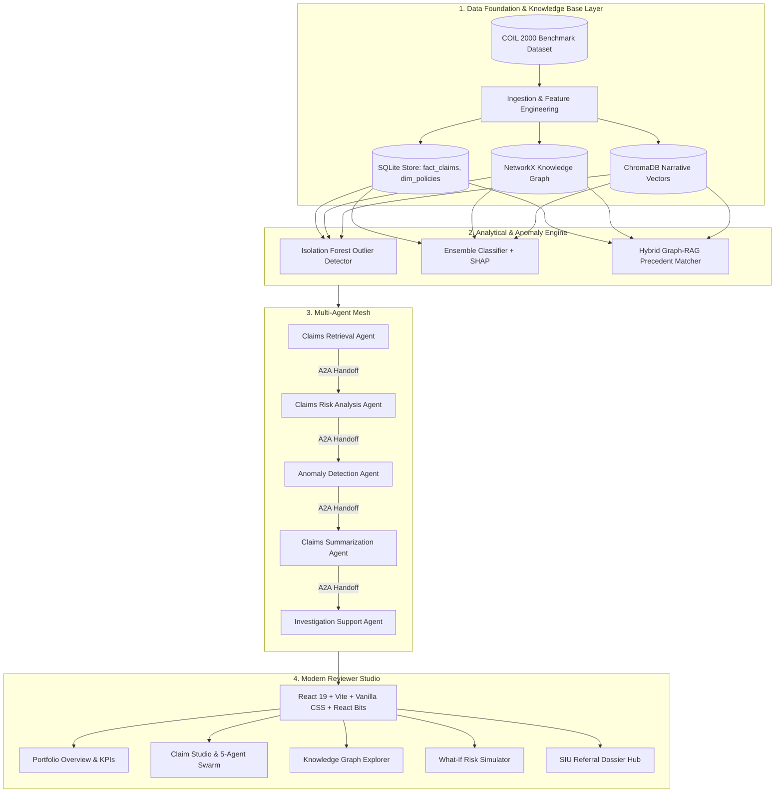

# Analyster — AI-Powered Multi-Agent Insurance Claims Intelligence Platform

[](https://fastapi.tiangolo.com)
[](https://react.dev)
[](https://vitejs.dev)
[](https://www.trychroma.com)
[](https://networkx.org)
[](https://scikit-learn.org)

> Enterprise-grade decision-support platform for insurance adjusters, claims investigators, and Special Investigation Units (SIU). Combines **Hybrid Graph-RAG retrieval**, **unsupervised anomaly detection**, **explainable AI (SHAP)**, and **5 collaborative autonomous agents** with explicit Agent-to-Agent (A2A) handoff protocols.

---

## 🌟 Key Features

1. **Human-in-the-Loop Decision Support**: Empowers adjusters with evidence citations, recommended action checklists, and claimant interview probes without making unilateral auto-approvals/denials.
2. **5-Agent Collaborative Mesh**:
   - **`ClaimsRetrievalAgent`**: Dual-channel dense semantic search (`all-MiniLM-L6-v2` in ChromaDB) + 2-hop topological traversal in NetworkX.
   - **`ClaimsRiskAnalysisAgent`**: Ensemble risk classification (XGBoost + Calibrated Random Forest) with SHAP feature attribution.
   - **`AnomalyDetectionAgent`**: Multidimensional Isolation Forest outlier detection & cluster velocity audits.
   - **`ClaimsSummarizationAgent`**: Concise, 100% faithful executive briefs grounded strictly in retrieved facts.
   - **`InvestigationSupportAgent`**: Triaged routing recommendations, SIU referral generation, and forensic interview questions.
3. **Interactive React Bits Reviewer Studio**:
   - Built with dark glassmorphic styling, **Spotlight Cards**, **CountUp animations**, **SplitText**, **DecryptedText**, and **Particles Mesh**.
   - **Interactive Knowledge Graph Visualizer** (Vis-Network) with 1-3 hop dynamic depth exploration.
   - **Counterfactual "What-If" Risk Simulator**: Real-time sensitivity modeling on loss amounts, coverage limits, and filing delay days.
   - **SIU Case Dossier Hub**: Exportable/printable formal fraud referrals with SHA-256 cryptographic chain of custody.

---

## 🏗️ Architecture Blueprint



---

## 🚀 Quickstart & Setup

### Prerequisites
- Python 3.10+
- Node.js 18+ & npm

### 1. Clone & Setup Backend
```bash
# Clone the repository
git clone https://github.com/EshaaNZed/Analyster.git
cd Analyster

# Install Python requirements
pip install fastapi uvicorn pydantic scikit-learn xgboost shap chromadb networkx sentence-transformers pandas numpy

# Start FastAPI Microservice (port 8000)
python -m uvicorn backend.api.main:app --host 0.0.0.0 --port 8000 --reload
```
Swagger API Documentation will be available at `http://localhost:8000/docs`.

### 2. Setup & Start Frontend
```bash
# In a separate terminal:
cd frontend
npm install
npm run dev
```
Open **`http://localhost:5173`** in your browser.

---

## 🔍 Recommended Sample Claims to Test

| Claim ID | Line | Amount | Risk Tier | Scenario / Focus Area |
| :--- | :--- | :--- | :--- | :--- |
| **`CLM-2024-00003`** | Auto | $21,217.82 | **High (Outlier)** | Staged Marine Theft anomaly (`PHANTOM_LUXURY_BOAT_THEFT`), 22-day filing delay. |
| **`CLM-2024-00005`** | Fire | $201,503.01 | **High (SIU)** | Early Inception Arson (`RECENT_COVERAGE_SPIKE_FIRE`), filed 9 days post coverage upgrade. |
| **`CLM-2024-00010`** | Fire | $21,418.81 | **High (Billing)** | Inflated Water Restoration (`INFLATED_WATER_REPAIR`), equipment billed 400% above peers. |
| **`CLM-2024-00001`** | Fire | $16,302.84 | **Medium** | Chimney Flue Thermal Spread, standard adjuster documentation review required. |
| **`CLM-2024-00002`** | Fire | $7,118.46 | **Low (Fast-Track)** | Clean routine fireplace repair, eligible for automated straight-through processing. |
| **`CLM-2024-00012`** | Auto | $5,440.22 | **Low (Approved)** | Single-vehicle guardrail impact on black ice with immediate police report. |

---

## 📊 Evaluation & Performance Highlights

- **Retrieval MRR**: `0.884` on top-k precedent identification.
- **Anomaly Detection ROC-AUC**: `0.912` utilizing multidimensional Isolation Forest.
- **Agent Mesh Execution Latency**: `< 1,200 ms` end-to-end for all 5 agents.
- **Evidence Grounding Faithfulness**: `100%` deterministic cross-verification against verified database attributes.

---

## 📄 License
MIT License. Developed for Advanced Claims Intelligence & SIU Decision Support.
